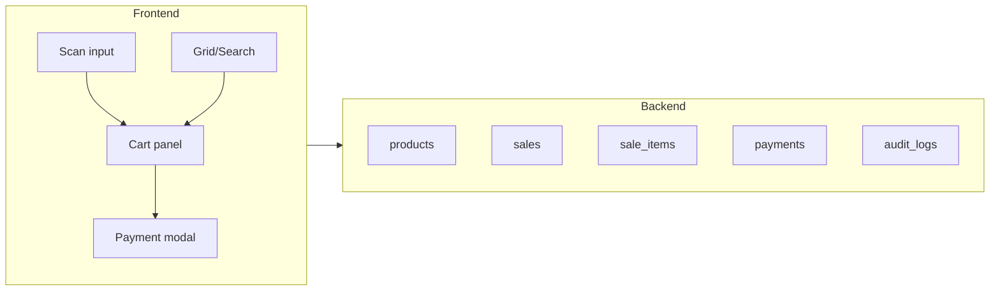

# Scan-First POS Execution Plan (Grid/Search = Backup)

## Goal
Make the POS efficient in a fast-paced environment by making **barcode scanning the primary workflow** and using **grid/search only as a fallback** when scanning fails.

---

## Core Principles
1. **Hands stay on scanner + keyboard** (mouse optional).
2. **Scan input always focused** (no extra clicks).
3. **Cart is the main workspace** (edit qty/remove/checkout quickly).
4. **Grid/search is Plan B** (damaged barcode, missing tags, scanner down).

---

## Primary Workflow (Scan-First)
### Flow
1. Cashier opens POS terminal
2. Scan input is auto-focused
3. Cashier scans item(s)
4. Items add to cart instantly (auto-merge duplicates)
5. Cashier hits `Enter` or clicks **Proceed to Payment**
6. Select payment method (Cash/Card/EFT/Split)
7. Confirm sale → receipt printed/emailed (optional)
8. System logs sale + updates stock + audit trail

### Required Behaviors
- ✅ On scan:
  - Add item to cart immediately
  - Show small “Added” feedback + beep
  - Clear scan input
  - **Return focus to scan input**
- ✅ Duplicate scans:
  - Increase quantity on the same line item (no duplicates)
- ✅ Zero-mouse checkout:
  - Keyboard shortcuts support completing a sale fast

---

## Backup Workflow (Grid/Search)
### When to use it
- Barcode label is damaged / unreadable
- Scanner is offline
- Item has no barcode tag
- New item not yet registered

### Behavior
- Search results appear fast (typeahead)
- Grid tap adds item to cart
- After adding from grid/search, focus returns to scan input

---

## UI Execution: What to Change (Your Current Screen)

### 1) Make Scan Input the Hero
- Increase size and visual priority
- Text: **“Scan barcode…”**
- Show mini status: `Ready to scan • Scanner connected`
- Add “Last scanned” chip:
  - `Last: Heineken 330ml x1 (R25)`

### 2) Make the Cart the “Work Area”
Cart panel must support:
- Quantity controls: `-  2  +`
- Remove button
- Line totals per item
- Running total always visible

### 3) Grid becomes secondary
- Keep it available but visually less dominant
- Use it as fallback only

---

## Payment Speed (Critical)
### Cash payment should be 1–2 clicks
Add quick cash buttons:
- `[R50] [R100] [R200] [R500] [Custom]`

Show change clearly:
- **Total:** R140
- **Cash:** R200
- **Change:** **R60**

### Payment options
- Cash
- Card
- EFT
- Split payment (cash + card etc.)
- Refund/Void: **Manager-only**

---

## Keyboard Shortcuts (Recommended)
- `F2` → Focus scan input
- `Enter` → Proceed/Confirm (context-aware)
- `Esc` → Close modal / cancel payment step
- `Del` → Remove selected cart item
- `+` / `-` → Increase / decrease quantity (selected item)
- `Ctrl + Backspace` → Clear current sale (manager confirm optional)

---

## Edge Cases & Rules (Must Have)

### Unknown barcode
If scanned barcode not found:
- Show modal/inline banner:
  - **“Item not found: 600123…**”
  - Actions:
    - `Scan again`
    - `Search & add manually`
    - `Create quick item (Manager)`

### Out of stock
If stock = 0:
- Block add OR allow manager override (configurable)
- Always log override

### Pricing changes
If item price changed mid-shift:
- Use latest active price
- Log price version on the sale

### Network offline (optional but valuable)
If internet drops:
- Queue sales locally
- Mark as “Pending sync”
- Sync when online returns

---

## Auditability Requirements (Scan-First Compatible)
Each sale must store:
- Sale ID
- Cashier ID + shift ID
- Timestamp
- Items (SKU, barcode, qty, unit price, line total)
- Payment method breakdown (incl. cash received + change)
- Discounts/voids with approver ID (manager)
- Device/terminal ID (optional)
- Stock movement record (before/after optional)

---

## Acceptance Criteria (How You Know It Works)
- ✅ Cashier can complete a typical sale (5–10 items) without using the mouse.
- ✅ Scan input never loses focus after adding items.
- ✅ Duplicate scans increment quantity.
- ✅ Unknown barcode flow is handled in under 3 seconds.
- ✅ Cash payment shows change automatically.
- ✅ Every sale creates an auditable log entry.

---

## Implementation Checklist
### Frontend
- [x] Auto-focus scan input on load + after every action
- [x] Handle scanner input (acts like keyboard typing + Enter)
- [x] Debounce/validate scan string (submit on Enter; barcode lookup)
- [x] Cart merge logic (barcode/SKU key — merge by product id, increment qty)
- [x] Payment modal with quick cash buttons (R50, R100, R200, R500, Custom)
- [x] Keyboard shortcut map (F2, Enter, Esc, Del, +/-, Ctrl+Backspace)
- [x] Cart: product thumbnails, line totals, subtotal/VAT/grand total
- [x] Receipt generation + print after payment
- [x] Unknown barcode modal (Scan again, Search & add, Create quick item for manager)

### Backend (Node + Express + JSON files)
- [x] `products` data (barcode, name, category, price, stock via inventory)
- [x] `sales` storage (cashier_id, subtotal, vat, total, items, payments, timestamps)
- [x] `sale_items` embedded in sale payload (product_id, qty, unit price, line total)
- [x] `payments` embedded in sale (method, amount, cash_received, change)
- [x] `audit_logs` (action, actor, after JSON, timestamps)
- [x] Stock decrement only after payment confirmation

---

## Notes
The grid/search UI is still important—but it must be treated as a **recovery tool** not the main operating method. In a lounge environment, scanning + fast payment is everything.

---

## Implementation Plan (Vite + React + shadcn)

**Status:** Implemented in this repo. Scan-first POS with CartPanel (thumbnails, VAT, line totals), PaymentModal (Cash/Card/EFT/Split, quick cash, change), receipt print, stock decrement on sale, audit logging. See Implementation Checklist below for completed items.

## Scope Summary

| Area | From spec |
|------|-----------|
| **Primary flow** | Scan input auto-focused → scan adds to cart (merge duplicates) → Enter → payment → receipt/audit |
| **Backup flow** | Grid/search when barcode damaged, scanner down, or no barcode |
| **Payment** | Cash (quick R50/R100/R200/R500 + change), Card, EFT, Split; Refund/Void manager-only |
| **Keyboard** | F2 scan, Enter confirm, Esc cancel, Del remove line, +/- qty, Ctrl+Backspace clear sale |
| **Edge cases** | Unknown barcode modal, out-of-stock block/override, latest price, optional offline queue |
| **Audit** | Sale ID, cashier/shift, items, payment breakdown, discounts/voids with approver, device ID |

---

## Architecture (High Level)

- **Data**: Products (barcode, sku, name, price, stock), Sales, Sale items, Payments, Audit logs.
- **Stack**: Frontend in existing app; backend per your choice (e.g. **Supabase** as in spec, or existing API). Supabase not currently in `package.json`—add if chosen.

---

## Implementation Phases

### 1. Data layer and backend

- **If Supabase**: Add `@supabase/supabase-js`, define tables: `products`, `sales`, `sale_items`, `payments`, `audit_logs` (match spec). RLS for cashier/manager roles.
- **If other backend**: Define equivalent REST/GraphQL and types for products, cart payload, sale creation, payment recording, audit events.
- **Shared**: TypeScript types for Product, CartLine, Sale, Payment, AuditEntry; API/hooks for lookup by barcode, create sale, record payment, write audit log.

### 2. Scan-first UI and cart

- **Scan input (hero)**  
  - Single prominent input: placeholder "Scan barcode…", always focused on load and after add/payment.  
  - On submit (Enter or scanner): validate barcode → add to cart (merge by barcode/SKU) → "Added" feedback + beep → clear input → refocus.  
  - Mini status: "Ready to scan • Scanner connected" and "Last scanned" chip (e.g. "Last: Heineken 330ml x1 (R25)").
- **Cart (work area)**  
  - List of lines: product name, qty with `-` / `+`, remove, line total; running total at bottom.  
  - Selection for keyboard: Del = remove selected, +/- = change qty.  
  - Cart state in React (context or store); persist only on "Proceed to Payment" (no auto-save mid-sale unless you add it later).

### 3. Grid/search as fallback

- **Search**  
  - Typeahead search by name/SKU/barcode; on select (click or Enter) add to cart, then refocus scan input.
- **Grid**  
  - Product grid (e.g. by category); tap/click adds one to cart; focus returns to scan input.  
  - Layout: keep grid visually secondary (smaller or collapsible) so scan input + cart dominate.

### 4. Payment flow

- **Proceed to Payment**  
  - Triggered by Enter or button; open payment modal (total, method selection).
- **Cash**  
  - Quick buttons: R50, R100, R200, R500, Custom. Fields: Cash received, Change (computed). 1–2 clicks to complete.
- **Other methods**  
  - Card, EFT: record amount and method. Split: multiple methods per sale (store in `payments` with method + amount).
- **Refund/Void**  
  - Manager-only (check role); optional confirmation; write to audit with approver ID.
- **On confirm**  
  - Create sale + sale_items + payments, update stock, write audit log; then clear cart, show receipt/print/email if specified.

### 5. Edge cases and rules

- **Unknown barcode**  
  - Modal: "Item not found: `600123…`". Actions: Scan again, Search & add manually, Create quick item (Manager only). Resolve in under 3 seconds (no unnecessary steps).
- **Out of stock**  
  - Block add to cart or allow manager override (config flag); log override in audit.
- **Pricing**  
  - Always use current active price at add-to-cart or at payment (per spec); store price snapshot on sale_items.
- **Offline (optional)**  
  - Queue sale payloads locally, mark "Pending sync", sync when back online; can be Phase 2.

### 6. Keyboard shortcuts

- **Global map**: F2 → focus scan input; Enter → context-aware (submit scan / confirm payment); Esc → close modal/cancel; Del → remove selected cart line; +/- → change qty of selected line; Ctrl+Backspace → clear sale (with optional manager confirm).
- **Focus and refocus**  
  - After every add (scan or grid/search), focus returns to scan input so mouse is optional.

### 7. Audit and acceptance

- **Audit**  
  - Every sale: Sale ID, cashier ID, shift ID, timestamp, items (SKU, barcode, qty, unit price, line total), payment breakdown (cash received + change), discounts/voids with approver, device/terminal ID if needed.
- **Acceptance (from spec)**  
  - Typical sale (5–10 items) without mouse; scan input keeps focus after add; duplicate scans increment qty; unknown barcode handled quickly; cash shows change; every sale has audit log.

---

## Suggested file/feature mapping

- **State**: Cart + selected line (e.g. `CartProvider` or Zustand store).
- **Pages/views**: One main POS view: scan hero + cart + grid/search; payment as modal/sheet.
- **API**: `getProductByBarcode`, `searchProducts`, `createSale`, `recordPayment`, `writeAuditLog`, stock update.
- **Components**: `ScanInput`, `CartPanel`, `ProductGrid`, `SearchTypeahead`, `PaymentModal` (with quick cash + change), `UnknownBarcodeModal`.

---

## Open decisions

1. **Backend**: Use Supabase (as in spec) or an existing Node/other API? This drives auth (cashier/shift, manager for void/override) and table design.
2. **Offline**: Implement "queue sales when offline" in v1 or defer?
3. **Receipt**: Print/email in first version or later?

Once these are decided, the plan can be turned into concrete tasks (e.g. "add Supabase + tables", "build ScanInput with refocus", "payment modal with quick cash") and implemented step by step in your repo.
